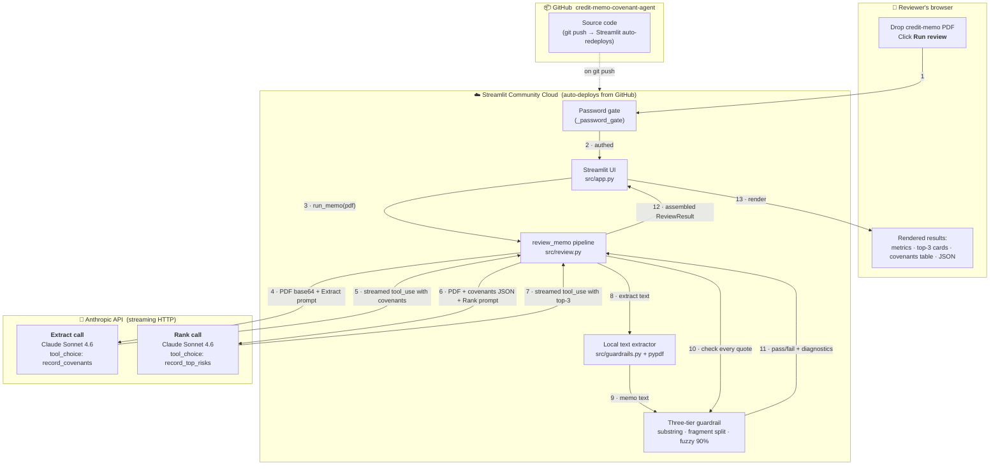

# Architecture

One page. Everything that happens when a reviewer drops a PDF onto the app and clicks **Run review**.

---

## The picture

---

## Reading the diagram

**Colours in your head:** the four boxes are four different places.

1. **The reviewer's browser** — everything they see. Nothing runs here except HTML/JS from Streamlit and the file selector for the PDF upload.
2. **Streamlit Community Cloud** — where our Python code actually runs. One container per user session. Holds the PDF in memory for the duration of one review, then deletes it.
3. **Anthropic's servers** — where Claude thinks. We send the PDF and prompts over HTTPS; Claude reads and writes back a structured JSON answer over a streamed connection.
4. **GitHub** — where the source code lives. Every push triggers Streamlit Cloud to redeploy within a minute.

**The 13 numbered arrows are one full review** from click to result. Total wall-clock time: ~15-45 seconds depending on memo size.

---

## The 13 steps, in plain English

| # | What happens | Where |
|---|---|---|
| 1 | Reviewer opens the app, enters the password | Browser → Streamlit |
| 2 | Password matches, main UI renders | Streamlit |
| 3 | Reviewer drops PDF, clicks Run — Streamlit calls `review_memo(pdf_path)` | Streamlit |
| 4 | Pipeline base64-encodes the PDF and sends it to Anthropic with the **Extract** prompt and the `record_covenants` tool schema. Streaming mode. | Streamlit → Anthropic |
| 5 | Claude reads the PDF, extracts every covenant, streams back a tool call with the structured list | Anthropic → Streamlit |
| 6 | Pipeline sends the **same PDF plus the extracted covenant list** to Anthropic with the **Rank** prompt and the `record_top_risks` tool schema | Streamlit → Anthropic |
| 7 | Claude picks the three highest-risk covenants, streams back a tool call with reasoning + memo quotes | Anthropic → Streamlit |
| 8 | Locally, pypdf reads the PDF's text layer for the safety check | Streamlit |
| 9 | Extracted memo text hands over to the guardrail | Streamlit |
| 10 | Pipeline asks the guardrail to verify every quote in the AI's output | Streamlit |
| 11 | Guardrail returns pass/fail per quote plus a diagnostic on how much text pypdf actually pulled out | Streamlit |
| 12 | Pipeline assembles a final `ReviewResult` (memo metadata + covenants + top-3 + run metadata) and returns it to the UI | Streamlit |
| 13 | UI renders metrics, top-3 cards, covenant table, guardrail status, JSON viewer and download button | Streamlit → Browser |

The dotted line at the bottom shows how a `git push` to GitHub triggers Streamlit Cloud to redeploy the app.

---

## Why the pipeline talks to Anthropic twice

Split into **Extract** and **Rank** on purpose:

- **Auditability.** A credit officer can eyeball the extracted covenant list against the memo's Section 5 before trusting the top-3 ranking. Single-shot collapses that check.
- **Better quality on each stage.** Single-shot consistently under-lists non-financial covenants (change of control, restricted payments) and over-weights whatever the memo's own executive summary flagged. Splitting the jobs makes each half sharper.
- **Debuggability under demo pressure.** If the demo breaks live, we can point to which call failed.

Cost of the split: roughly 2× tokens and 2× latency. Invisible on a demo. Would revisit at scale with prompt caching (~35% cost recovery).

---

## Why the guardrail runs locally

The AI's output claims: "here is a covenant, and here is the exact quote from the memo that proves it." We verify locally that the quote is actually in the memo, using pypdf to pull the memo's text layer. Three tiers of check (exact substring → fragment split → fuzzy word overlap at 90%) so we don't false-positive on table-row reconstructions or scanned-PDF extractor drift. Full logic in [src/guardrails.py](src/guardrails.py).

---

## What lives where — quick reference

| Component | File | Job |
|---|---|---|
| Streamlit UI | [src/app.py](src/app.py) | Password gate, file upload, results view, JSON download |
| Main pipeline | [src/review.py](src/review.py) | `review_memo()` — the orchestrator; `run_extract()`, `run_rank()`, `_stream_message()` |
| Data shapes | [src/schemas.py](src/schemas.py) | Pydantic models + Anthropic tool schemas |
| Prompts | [src/prompts.py](src/prompts.py) | Two versioned system prompts (v2) |
| Safety check | [src/guardrails.py](src/guardrails.py) | `extract_pdf_text()`, three-tier `check_quotes()` |
| Runtime config | [runtime.txt](runtime.txt), [requirements.txt](requirements.txt) | Python 3.11, dependency list for Streamlit Cloud |
| Local secrets | `.env` (gitignored), [.env.example](.env.example) | `ANTHROPIC_API_KEY` |
| Cloud secrets | Streamlit Cloud "Secrets" panel | Same key, different source |
